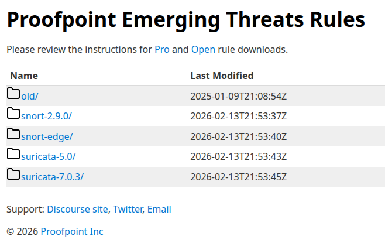

# Design of a IDSP Using Well Known Tools
Research documentation as part of CRSP CUNY.  

## Environment Setup
Enable libvirtd service
```
sudo systemctl start libvirtd.service
```

Open virt-manager Virtual Machinve manager
```
virt-manager
```

Using only one virtual machine running Debian/LXDE

## Background Knowledge
### Suricata
(Done) [Quickstart guide](https://docs.suricata.io/en/suricata-8.0.2/quickstart.html#basic-setup)

(10. Making sense out of Alerts) [Rule Management](https://docs.suricata.io/en/suricata-8.0.2/rule-management/suricata-update.html)

Version: 7.0.10

Configuration file
```
sudo vim /etc/suricata/suricata.yaml
```

Running Suricata
```
sudo systemctl restart suricata
```

#### Logs and Stats Directory

```
ls /var/log/suricata/
```

To see alerts:
```
sudo tail -f /var/log/suricata/fast.log
```

To see rules (fetched using suricata-update, size: 41M):
```
/var/lib/suricata/rules/suricata.rules
```

#### Fetching ET Open ruleset
"With teh tool suricata-update rules can be fetched to be provided for Suricata"
```
sudo suricata-update
```

To enable rules that are disabled by default, use /etc/suricata/enable.conf

### Malware-Traffic-Analysis.com
- [2026-01-31 - TRAFFIC ANALYSIS EXERCISE: LUMMA IN THE ROOM-AH](https://www.malware-traffic-analysis.net/2026/01/31/index.html)

## Challenges & Resolutions
The Rule trigger example from the Suricata's Quickstart guide was not working on Debian VM. Thanks to this [article](https://www.criticaldesign.net/post/how-to-setup-a-suricata-ips), I realized that the interface parameter was misconfigured. I fixed it by switching from 'eth0' to 'enp1s0'.


## Rules
[Proofpoint Emerging Threats Rules](https://rules.emergingthreats.net/)



