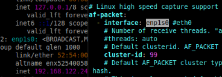
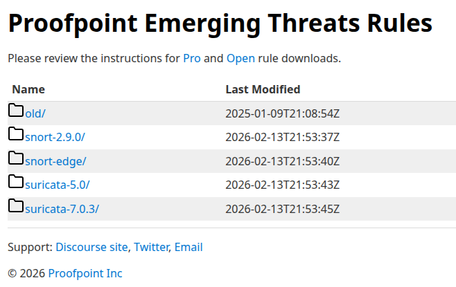
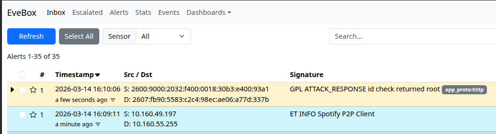
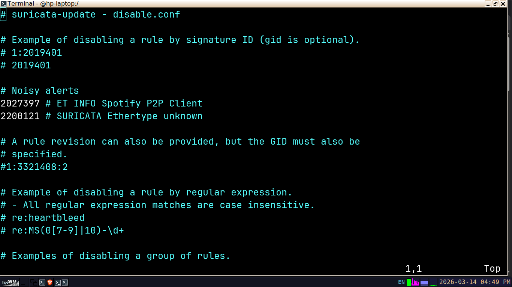
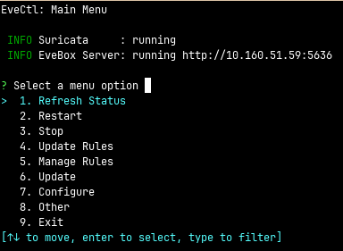
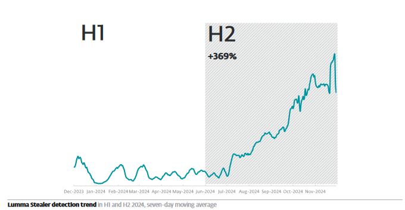
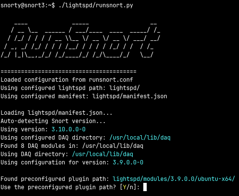
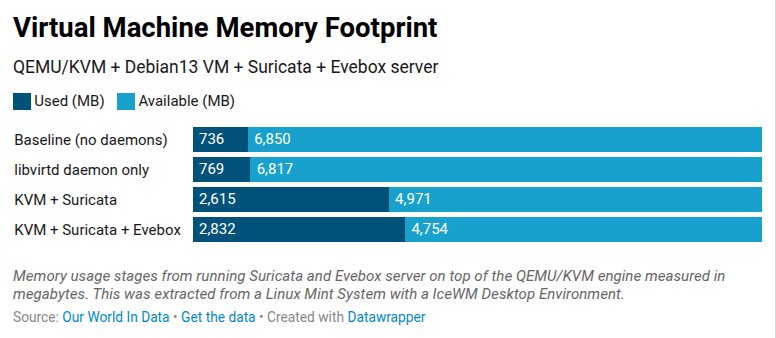
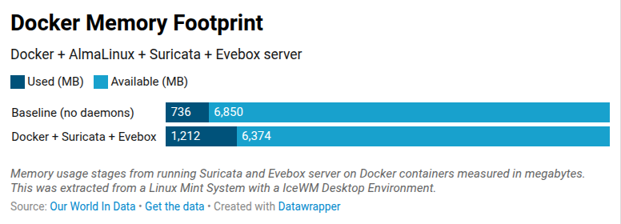

# Design of a IDSP Using Well Known Tools
Research documentation as part of CRSP CUNY.  

## Table of Contents
- Environment Setup
- Background Knowledge
- Challenges and Resolutions
- Snort and Suricata Rules
- Event Viewer and Alert Management Tool (Evebox)
- Experiments

## Environment Setup
Enable libvirtd service
```
sudo systemctl start libvirtd.service
```

Open virt-manager Virtual Machinve manager
```
virt-manager
```

Using only one virtual machine running Debian/LXDE

## Background Knowledge
### Suricata (Version: 7.0.10)
- (Done) [Rule Management](https://docs.suricata.io/en/suricata-8.0.2/rule-management/suricata-update.html)
- (Done) [Quickstart guide](https://docs.suricata.io/en/suricata-8.0.2/quickstart.html#basic-setup)
- (Done) [Suricata Rules](https://docs.suricata.io/en/suricata-8.0.2/rules/intro.html)  
- (11.9. Rule Profiling) [Performance](https://docs.suricata.io/en/latest/performance/)

**Statistics Notes**
- Tools to plot graphs: [Monitoring with Zabbix](http://christophe.vandeplas.com/2013/11/suricata-monitoring-with-zabbix-or-other.html), [Suri-stats](https://github.com/regit/suri-stats)  

**Suricata Rules Notes**
1. What are sticky buffers? Placen the buffer names first, then placing keywords that apply to it(e.g. http.uri; content:"hello")   
2. I think I understand the rule matching process, the syntax goes by key-pairs (key:pair) separated by semicolons. If a key has no pair (e.x. "...;ip.src;..." or "...dns.query;..." or "...;http.method;...") look up next key-pair value which will provide the info needed for the pairless key (e.x "ip.src;dataset:badips" or "dns.query;dataset:dns-bl" or http.method;content:"GET")  
* a function can be passed like (dns.query;to_md5;dataset:dns-bl)  
```
For example, to match against a DNS black list called dns-bl:

dns.query; dataset:isset,dns-bl; # This can be helpful to understand rule matching
```

"Normalized buffers are: all HTTP-keywords, reassembled streams, TLS-, SSL-, SSH-, FTP- and dcerpc-buffers"


3. Transactional rules (=>) [source](https://docs.suricata.io/en/suricata-8.0.2/rules/intro.html#transactional-rules)  
```
alert http any any => 5.6.7.8 80 (    # Match only when uri is sent and server responds with 200 stat code
  msg:"matching both uri and status";
  sid: 1;
  http.uri; content: "/download";
  http.stat_code; content: "200";
)
```

**Signatures using Regular Expressions for String Matching**  
```
alert ip any any -> any any (msg:"GPL ATTACK_RESPONSE id check returned root"; content:"uid=0|28|root|29|"; classtype:bad-unknown; sid:2100498; rev:7; metadata:created_at 2010_09_23, updated_at 2010_09_23;)
```
content="uid=0|28|root|29" means match whether uid=0, or uid=28, ..., uid=29. This example uses the pipe operator in ReGex.

Configuration file
```
sudo vim /etc/suricata/suricata.yaml
```

Running Suricata
```
sudo systemctl restart suricata
```

#### Logs and Stats Directory

```
ls /var/log/suricata/
```

To see alerts:
```
sudo tail -f /var/log/suricata/fast.log
```

To see rules (fetched using suricata-update, size: 41M):
```
/var/lib/suricata/rules/suricata.rules
```

#### Fetching ET Open ruleset
"With teh tool suricata-update rules can be fetched to be provided for Suricata"
```
sudo suricata-update
```

To enable rules that are disabled by default, use /etc/suricata/enable.conf

### Malware-Traffic-Analysis.com
- [2026-01-31 - TRAFFIC ANALYSIS EXERCISE: LUMMA IN THE ROOM-AH](https://www.malware-traffic-analysis.net/2026/01/31/index.html)

## Challenges & Resolutions
The Rule trigger example from the Suricata's Quickstart guide was not working on Debian VM. Thanks to this [article](https://www.criticaldesign.net/post/how-to-setup-a-suricata-ips), I realized that the interface parameter was misconfigured. I fixed it by switching from 'eth0' to 'enp1s0'.



## Snort and Suricata Rules
[Proofpoint Emerging Threats Rules](https://rules.emergingthreats.net/)
'The "ET" indicates the rule came from the Emerging Threats (Proofpoint) project.'



## Event Viewer and Alert Management Tool
[Evebox](https://github.com/jasonish/evebox) is a "a web-based, open-source event viewer and alert management tool."
[Evectl](https://evebox.org/evectl) "is a tool to help easily manage Suricata and EveBox on Linux systems using containers with Docker or Podman.". That is why I spent two weeks learning about Docker.  



Disabling ET INFO Spotify, which is a noisy alert.  


Evectl TUI  


### [Docker](https://docs.docker.com/get-started/docker-overview/)
Source: https://docs.docker.com/engine/install/ubuntu/

Evebox Docker container was configured using the tutorial: [From Zero to a Home IDS Dashboard: Suricata + EveBox (with live alerts, GeoIP & rule tuning)](https://medium.com/@oscar.yanez.feijoo/from-zero-to-a-home-ids-dashboard-suricata-evebox-with-live-alerts-geoip-rule-tuning-0046003148fc)

Make sure Docker is enabled. Then run.
```
docker start evebox
```

Then access the web interface using ```https://localhost:5636```

### Local
I installed .deb package for debian at [Debian/Ubuntu x86_64](https://evebox.org/#downloads)
Runnig with ```evebox server -D . --datastore sqlite --input /var/log/suricata/eve.json```

Evebox filter syntax: Lucene-based query syntax

Evebox config file: ```/etc/evebox/evebox.yaml```

Task: Investigate how rule signatures work and how they are triggered. (Done)

## Replaying Traffic
[Tcpreplay](https://tcpreplay.appneta.com/) "is a suite of free Open Source utilities for editing and replaying previously captured network traffic".  
**Notes:** A mistake I make when I used this command last semester was not using the flag --topspeed. Without it, the replays took longer because it replayed the traffic at the same pace as it was captured.

```bash
root@pw29:~# tcpreplay -i eth7 -tK --loop 5000 --unique-ip smallFlows.pcap
File Cache is enabled
Actual: 71305000 packets (46082655000 bytes) sent in 38.05 seconds.
Rated: 1194330011.6 Bps, 9554.64 Mbps, 1848020.72 pps
Flows: 6045000 flows, 156669.03 fps, 71215000 flow packets, 90000 non-flow
Statistics for network device: eth7
	Attempted packets:         71305000
	Successful packets:        71305000
	Failed packets:            0
	Truncated packets:         0
	Retried packets (ENOBUFS): 0
	Retried packets (EAGAIN):  0
```

## Experiments
### 2026-01-31-traffic-analysis-exercise

  
"ESET telemetry shows a massive rise in detection of Lumma Stealer for H2 2024." (Source: ESET Threat Report H2 2024)  

**Suricata**  
Rules used for Suricata: https://rules.emergingthreats.net/open/suricata-7.0.3/  
emerging-all.rules	2026-03-23T20:40:35Z	41.77 MB

**True Positives:** 13  
**False Positives:** 7  
**False Negative:** 0  

**Precision:** 65%  
**Recall:** 100%  
**F1 Score:** 78%  

| # | Count | Signature | Src -> Dst | Class | Rationale |
|---|-------|-----------|-----------|-------|-----------|
| 1 | 4 | SURICATA STREAM ESTABLISHED packet out of window (app_proto:smb) | 10.1.21.2 → 10.1.21.58 | FP | SMB stream reassembly noise from the DC; TCP artifact, not a confirmed malicious indicator |
| 2 | 4 | SURICATA STREAM ESTABLISHED invalid ack (app_proto:smb) | 10.1.21.58 → 10.1.21.2 | FP | TCP stream anomaly on SMB to DC; benign reassembly artifact |
| 3 | 4 | SURICATA STREAM Packet with invalid ack (app_proto:smb) | 10.1.21.58 → 10.1.21.2 | FP | Same as above; TCP artifact on normal SMB domain traffic |
| 4 | 1 | ET JA3 Hash — Possible SoftEther Windows Client SSTP Traffic (sni:communicationfirewall-security.cc) | 10.1.21.58 → 104.21.9.36 | TP | Lumma Stealer uses the SoftEther JA3 fingerprint; .cc domain is confirmed C2 |
| 5 | 15 | ET MALWARE Observed Win32/Lumma Stealer Related Domain (whitepepper.su) in TLS SNI | 10.1.21.58 → 153.92.1.49 | TP | Direct Lumma Stealer C2 domain hit in TLS SNI; high-confidence match |
| 6 | 13 | ET JA3 Hash — Possible SoftEther Windows Client SSTP Traffic (sni:whitepepper.su) | 10.1.21.58 → 153.92.1.49 | TP | Lumma's characteristic JA3 fingerprint to confirmed C2 host |
| 7 | 1 | ET DROP Spamhaus DROP Listed Traffic Inbound group 10 | 80.97.160.24 → 10.1.21.58 | TP | Inbound from a Spamhaus DROP-listed IP to the infected host; corroborates active C2 |
| 8 | 2 | ET DNS Query for .cc TLD (rrname:communicationfirewall-security.cc) | 10.1.21.58 → 10.1.21.2 | TP | Infected host resolving a known Lumma C2 domain via .cc TLD |
| 9 | 1 | SURICATA STREAM ESTABLISHED packet out of window (app_proto:tls) | 10.1.21.58 → 153.92.1.49 | TP | Stream anomaly on confirmed C2 channel (153.92.1.49 = whitepepper.su); malicious context makes this TP |
| 10 | 10 | ET MALWARE Win32/Lumma Stealer Related CnC Domain in DNS Lookup (whitepepper.su) | 10.1.21.58 → 10.1.21.2 | TP | DNS lookup for confirmed Lumma C2 domain; direct signature match |
| 11 | 10 | ET DNS Query for .su TLD (Soviet Union) Often Malware Related (rrname:whitepepper.su) | 10.1.21.58 → 10.1.21.2 | TP | .su lookup confirmed malicious (whitepepper.su = Lumma C2) |
| 12 | 6 | ET INFO HTTP Request to .su TLD (Soviet Union) Often Malware Related (hostname:whitepepper.su) | 10.1.21.58 → 153.92.1.49 | TP | HTTP to confirmed Lumma C2 host; staging/fingerprinting phase |
| 13 | 1 | ET MALWARE Lumma Stealer Victim Fingerprinting Activity (hostname:whitepepper.su) | 10.1.21.58 → 153.92.1.49 | TP | The scenario's primary alert; Lumma performing victim fingerprinting — highest-confidence TP |
| 14 | 2 | ET MALWARE Win32/Lumma Stealer Related CnC Domain in DNS Lookup (whooptm.cyou) | 10.1.21.58 → 10.1.21.2 | TP | Second Lumma C2 domain resolved by infected host |
| 15 | 1 | ET MALWARE Observed Win32/Lumma Stealer Related Domain (whooptm.cyou) in TLS SNI | 10.1.21.58 → 62.72.32.156 | TP | TLS connection to second confirmed Lumma C2 domain |
| 16 | 1 | ET JA3 Hash — Possible SoftEther Windows Client SSTP Traffic (sni:whooptm.cyou) | 10.1.21.58 → 62.72.32.156 | TP | Lumma JA3 fingerprint on second C2 channel |
| 17 | 1 | SURICATA STREAM excessive retransmissions (app_proto:tls) | 104.21.46.67 → 10.1.21.58 | FP | 104.21.46.67 is a Cloudflare IP; retransmissions are TCP noise, no confirmed malicious association |
| 18 | 1 | SURICATA STREAM excessive retransmissions (app_proto:tls) | 10.1.21.58 → 104.17.25.14 | FP | 104.17.25.14 is also Cloudflare; TCP retransmission noise |
| 19 | 2 | ET JA3 Hash — Possible SoftEther Windows Client SSTP Traffic (sni:assets.adobedtm.com) | 10.1.21.58 → 184.29.31.84 | FP | Adobe DTM is a legitimate marketing tag manager CDN; JA3 match is coincidental |
| 20 | 1 | ET INFO Microsoft Connection Test (hostname:www.msftconnecttest.com) | 10.1.21.58 → 23.55.178.249 | FP | Normal Windows network connectivity probe; fully benign |

**Snort3 (Version 3)**  
ciscotalos/snort3 docker container  
Source: https://hub.docker.com/r/ciscotalos/snort3  

Start the Container  
```
$ docker run --name snort3 -h snort3 -u snorty -w /home/snorty -d -it ciscotalos/snort3 bash  
```
Enter the Snort Container  
```
$ docker exec -it snort3 bash
```
Stop  
```
docker kill snort3
```

runsnort.py script provided by Talos_LightSPD  


**Command used, automatically generated by runsnort.py**  
Maximum Detection Model Command  
```
snort -c lightspd/policies/3.1.0.0-0/maximum-detection.lua --daq-dir /usr/local/lib/daq -A alert_fast --plugin-path lightspd/modules/3.9.0.0/ubuntu-x64/ -q -r /home/snorty/2026-01-31-traffic-analysis-exercise.pcap
```

**Problems**  
[Snort3, Snort2lua, and the Emerging Threats Snort 2.9 ruleset](https://community.emergingthreats.net/t/snort3-snort2lua-and-the-emerging-threats-snort-2-9-ruleset/475https://community.emergingthreats.net/t/snort3-snort2lua-and-the-emerging-threats-snort-2-9-ruleset/475)  Did not work because the rules were not compatible with the version of Snort I was using  

**True Positives:** 3  
**False Positives:** 6  
**False Negative:** 0  

**Precision:** 33%  
**Recall:** 100%  
**F1 Score:** 50%  

| # | Count | Signature | SID | Src → Dst | Class | Rationale |
|---|-------|-----------|-----|-----------|-------|-----------|
| 1 | 7 | INDICATOR-SCAN UPnP service discover attempt | 1:1917:16 | 10.1.21.58 → 239.255.255.250:1900 | FP | Standard Windows UPnP multicast probe; normal host behaviour |
| 2 | 4 | PROTOCOL-DNS dns response for rfc1918 10/8 address detected | 1:13249:14 | 10.1.21.2 → 10.1.21.58 | FP | DC responding with internal RFC1918 addresses; normal in an AD environment |
| 3 | 18 | SERVER-OTHER Novell eDirectory LDAP server buffer overflow attempt | 1:44604:1 | 10.1.21.58 → 10.1.21.2:389 | FP | Rule pattern-matches on Windows LDAP to the AD DC; Novell eDirectory not present — false match |
| 4 | 12 | PROTOCOL-ICMP destination unreachable port unreachable packet detected | 1:402:16 | 10.1.21.58 → 10.1.21.2 | FP | Normal ICMP unreachable messages; network noise, not malicious |
| 5 | 10 | INDICATOR-COMPROMISE Suspicious .su dns query | 1:27721:4 | 10.1.21.58 → 10.1.21.2:53 | TP | DNS queries for whitepepper.su — confirmed Lumma Stealer C2 domain |
| 6 | 4 | SERVER-OTHER WolfSSL PSK extension buffer overflow attempt | 1:59597:1 | 10.1.21.58 → external:443 | FP | False match on legitimate TLS handshakes to external IPs (Google, Akamai); WolfSSL not in use |
| 7 | 4 | INDICATOR-COMPROMISE Suspicious .cc dns query | 1:28190:4 | 10.1.21.58 → 10.1.21.2:53 | TP | DNS queries for communicationfirewall-security.cc — confirmed Lumma Stealer C2 domain |
| 8 | 67 | NETBIOS SMB samr named pipe creation attempt | 1:38322:2 | 10.1.21.58 → 10.1.21.2:445 | FP | Normal Windows domain authentication uses the SAMR pipe; expected in AD environment |
| 9 | 1 | MALWARE-CNC DNS Fast Flux attempt | 1:57756:2 | 10.1.21.2 → 10.1.21.58 | TP | DC returning a fast-flux DNS response for a Lumma C2 domain; confirmed malicious |

## Lumma Stealer Signature
```
alert tls $HOME_NET any -> any any (msg:"ET MALWARE Observed Win32/Lumma Stealer Related Domain (whitepepper .su) in TLS SNI"; flow:established,to_server; tls.sni; bsize:14; content:"whitepepper.su"; fast_pattern; nocase; reference:md5,dc518a45c58b82ed194c465ba1c73148; classtype:domain-c2; sid:2066542; rev:1; metadata:tls_state TLSEncrypt, created_at 2025_12_31, deployment Perimeter, malware_family Lumma_Stealer, confidence High, signature_severity Critical, updated_at 2025_12_31, mitre_tactic_id TA0011, mitre_tactic_name Command_And_Control, mitre_technique_id T1071, mitre_technique_name Application_Layer_Protocol; target:src_ip;)
```

## Performance

Docker memory savings vs QEMU/KVM  
−1,620 MB  
57% less used memory  





System: Linux hp-laptop 6.14.0-29-generic #29~24.04.1-Ubuntu SMP PREEMPT_DYNAMIC Thu Aug 14 16:52:50 UTC 2 x86_64 x86_64 x86_64 GNU/Linux  
DE: ICEWM  

Baseline (Docker and libvirtd deamons inactive)  
Memory represented in Megabytes  
```
               total        used        free      shared  buff/cache   available
Mem:            7586         736        6589          32         529        6850
Swap:           2047           0        2047
```

- QEMU/KVM + Debian13 VM + Suricata + Evebox  

libvirtd service is started using systemctl  
```
               total        used        free      shared  buff/cache   available
Mem:            7586         769        6536          34         551        6817
Swap:           2047           0        2047
```

Debian 13 (LXDE) Virtual machine is turned on, Suricata is active.  
```
               total        used        free      shared  buff/cache   available
Mem:            7586        2615        3978          45        1277        4971
Swap:           2047           0        2047
```

Debian 13 (LXDE) Virtual machine is turned on, Suricata is active, and Evebox server.  
```
               total        used        free      shared  buff/cache   available
Mem:            7586        2832        3637          63        1420        4754
Swap:           2047           0        2047
```

- Docker + Suricata + Evebox  

Evectl is called, enabling Docker
```
               total        used        free      shared  buff/cache   available
Mem:            7586        1212        5228          35        1419        6374
Swap:           2047           0        2047
```
